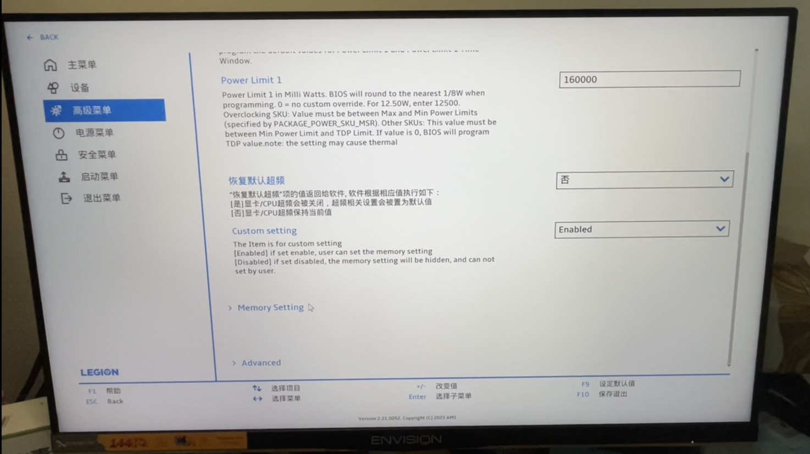
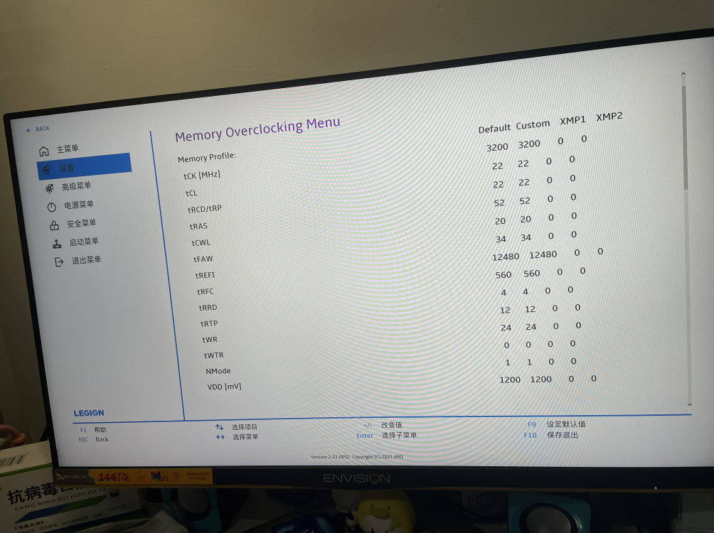

# 联想刃7000k2021-3060版解锁BIOS隐藏选项

### 使用方式

* 以管理员权限运行**unlock.exe**即可

### 注意

* 本软件仅修改NVRAM变量不修改任何其他BIOS数据，安全稳定
* 解锁高级功能后在BIOS内所作的修改造成不良后果与此软件无关！**请谨慎操作！**
* BIOS更新会导致解锁失效，需再次运行unlock.exe解锁

### 免责声明

- **RUN ON YOUR OWN RISK !!!**

- **该程序仅供学习交流，严禁使用于任何商业用途，若产生利益纠纷，概不负责。**

- **请尊重作者的劳动成果，如需转载，请注明出处，谢谢！**

- **不可将此脚本二次创作后用于商业目的！**

  

